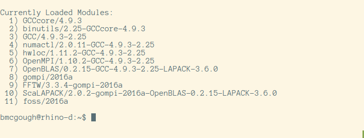

# EasyBuild

---

# Fred Hutch Researchers

## What they want:
1. reliable systems and hardware
2. reliable software:
  - current versions built consistently and quickly
  - software and version accounting for all jobs
  - reliable citation sources -> re-producibility

---

# Reliable Systems & Hardware

## Out of scope (call us)

---

# Reliable Software

## EasyBuild
challenges: download tarball, build process, pre-requisites, integration with env modules, repeat with next version in the same way

"./configure; make; make install"

---

# EasyBuild is...

## building software with ease
 
### Features
 
- multiple versions and builds of many software packages
- automated dependency system
- re-producible software package builds
- automated environment modules managment
- curated toolchains

---

# EasyBuild Benefits

- 1058 Software Packages (6600+ package versions)
- 54 toolchains
- 150+ contributors
- 87% coverage of our existing software stack

---

# EasyBuild Understanding

- Terms & Components
- Building software
- Fred Hutch Implementation
- Community and Collaboration

---

# EasyBuild Terms

- **environment modules** (`module load`)
- **easyconfigs** (recipes)
- **toolchains** (ex: GCC/Intel)

---

# Environment Modules

---

# Environment Module Overview
 
- sets and unsets environment variables
- avoids conflicts between software packages
- provides dependency resolution
- provides administrative hooks
 
---
 
# How It Works
 
Environment Variables integrates with the users shell

- shell function/alias module()
- calls `modulecmd`
- `modulecmd` echoes shell cmds to be eval'd

---

# Example of module use
 
     !bash
     $ which R
     /usr/bin/R
     $ module load R/3.3.0-intel-2016a
     $ which R
     /app/easybuild/software/R/3.3.0-intel-2016a/bin/R

---

# Dependency Example

---

# Shell Env Example

---

# Easyconfigs

---

# Easyconfigs

Easyconfigs...

- are text files (python)
- define a software package + version + toolchain
- can define extentions/modules/libraries
- can define options and environment variables

---

# Easyconfig Example

    !python
    easyblock = 'ConfigureMake'
    name = 'make'
    version = '4.1'
    homepage = 'http://www.gnu.org/software/make/make.html'
    description = "GNU version of make utility"
    toolchain = {'name': 'GCC', 'version': '4.9.2'}
    source_urls = [GNU_SOURCE]
    sources = [SOURCE_TAR_BZ2]
    moduleclass = 'devel'

---

# Toolchains

---

# What are toolchains exactly?

- are defined in easyconfig files
- are a collection of compilers and support libraries
- provide consistent build parameters/env
- are a great place for optimization fan-out

---

# How far does it go?

Down:

- just above kernel/hardware
- is inconsistent

Up:

- build tools (compilers, static base libraries)

---

# Toolchain example

    GCCcore/4.9.3
    binutils/2.2.5-GCCcore-4.9.3
    GCC/4.9.3-2.25
    numactl/2.0.11-GCC-4.9.3-2.25
    hwloc/1.11.2-GCC-4.9.2-2.25
    OpenMPI/1.10.2-GCC-4.9.3-2.25
    OpenBLAS/0.2.15-GCC-4.9.3-2.25-LAPACK-3.6.0
    gompi/2016a
    FFTW/3.3.4-gompi-2016a
    ScaLAPACK/2.0.2-gompi-2016a-OpenBLAS-0.2.15-LAPACK-3.6.0

---
# Toolchain example pic

---

# Why do you care about Toolchains?

- optimize module stacks
- optimize software
- aid in *re-producibility*

---

# Toolchains and performance

rbench:

- *Base R*: 179 secs
- EasyBuild *foss-2016a R*: 83 secs (54% faster)
- EasyBuild *intel-2016a R*: 91 secs (49% faster)
- *Microsoft R Optimized (MRO)*: 86 secs (52% faster)

---

# Re-producibility

---

# Common citation

Software is commonly cited using some combination of:

   - Author Name (ex)
   - Project Name
   - URL

---

# EasyBuild possible citation

show easyconfig URL (ex)
using that easyconfig will produce the same software built in the same way as the cited data

- software + version + toolchain + release
- compiler + libraries + parameters + options

The easyconfig will allow one to re-build precisely.

---

# EasyBuilding Software

---

# Prerequisites

- Python
- Environment Modules

Use *Lmod* if modules are new for you.

---

# Bootstrapping EasyBuild

    !bash
    $ curl -O https://raw.github.../bootstrap_eb.py
    $ python bootstrap_eb.py $EASYBUILD_PREFIX
    $ module use $EASYBUILD_PREFIX/modules/all
    $ module load EasyBuild

---

# build something

Let's build something

---

# EasyBuild @FredHutch

---

# Fred Hutch goals

- centralized, shared packages
- non-root, multiple, individual builders in a group
- fast release of new versions
- "fat" R with up-to-date libraries optimized

---

# Executive decisions

Toolchains:

- **foss-n:** Free Open Source Software - GCC and friends
- **intel-n:** Intel C and Fortran

Deployment:

- universal read-only NFS export
- common EasyBuild hierarchy
 
---

# Engineering Decisions

- NFS mounted /app on all systems (nfs ro)
- EasyBuild PREFIX owned by POSIX group
- EASYBUILD ENV VARS to support group building
- EasyBuild is easy-built; everything in /app
- EasyBuilds done on a build host (nfs rw)

---

# EasyBuild @FredHutch Metrics

- 218/757 software packages/versions built (add pkg list)
- 86% built in 4 months
- 87% of our old software stack re-built
- 4 SysAdmins independently building consistent packages

---

# What's the catch?

- adapting existing easyconfigs is easy
- writing new easyconfigs is not easy
- existing community accepts all easyconfigs
- proliferation of matrix
- inconsistent support packages

---

# FredHutch Next Step Goals

- reduce EasyBuild ramp-up time
- build EB life-sciences community
- create github-based workflow for easyconfigs
- provide new versions quickly/publicly
- share tools and code
- reduce complexity of writing new easyconfigs

---

# Next Step Details

- provide 200+ life sciences packages in an hour
- help implement expanded toolchains/package clusters
- publish easyconfigs
  - upstream
  - life-sciences github repo
- published detailed implementation example
- take ownership of R easyconfig
- implement EasyBuild in a container
