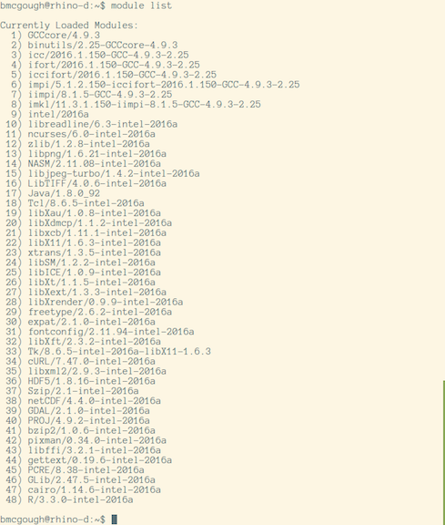
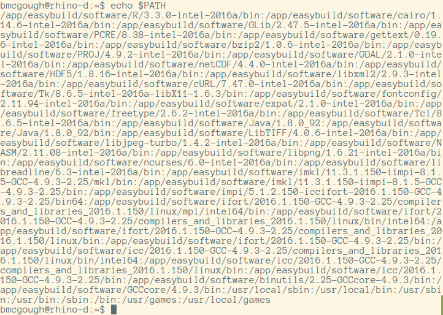

# EasyBuild

---

# Fred Hutch Researchers

## What they want:
1. reliable systems and hardware
2. reliable software

---

# Reliable Systems & Hardware

## Out of scope (call us)

---

# What about software?

- current versions built consistently and quickly
- software and version accounting for all jobs
- reliable citation sources and re-producibility

---

# How do we do it?

`./configure; make; sudo make install`

Download tarball, check required packages, **install them**, build, re-check required packages, make test, **make install**, build modulefile.

Then repeat:
- for the next package
- *exactly* for new versions of this package

---

# Reliable Software

EasyBuild: building software with ease
 
### Features
 
- multiple versions and builds of many software packages
- automated package dependency system
- re-producible software package builds
- automated environment modules managment
- curated toolchains

---

# EasyBuild Benefits

- 1058 Software Packages (6600+ package versions)
- 54 toolchains
- 150+ contributors
- 87% of our existing software stack out of the box

---

# EasyBuild Understanding

- Terms & Components
- Building software
- Fred Hutch Implementation
- Community and Collaboration

---

# EasyBuild Terms

- **environment modules** (`$ module load R`)
- **easyconfigs** (*build recipe*)
- **toolchains** GCC, Intel, Clang/LLVM, etc. + libs

---

# Environment Modules

---

# Environment Module Overview
 
- sets and unsets environment variables
- avoids conflicts between software packages
- provides dependency resolution
- provides administrative hooks
 
---
 
# Use Environment Modules...

- simple, end user-driven, scriptable
- administrative hooks
- greatly simplifies tangled, gnarly environments
- use *Lmod* if you can

---

# ... with EasyBuild!

- automated modulefile creation
- managment of module hierarchy
- don't write modules, just use them

---

# Module Dependency Example

---

# Shell Env Example

---

# Easyconfigs

---

# Easyconfigs

Easyconfigs...

- are text files (python)
- define a software package + version + toolchain
- can define extentions/modules/libraries
- can define options and environment variables

---

# Easyconfig Example

    !python
    name = 'git'
    version = '2.8.0'
    homepage = 'http://git-scm.com/'
    description = """Git is a free and open source distributed version control system designed
    to handle everything from small to very large projects with speed and efficiency."""
    toolchain = {'name': 'foss', 'version': '2016a'}
    sources = ['v%(version)s.tar.gz']
    source_urls = ['https://github.com/git/git/archive']
    dependencies = [
    ('cURL', '7.47.0'),
    ('expat', '2.1.0'),
    ('gettext', '0.19.7'),
    ('Perl', '5.22.1', '-bare'),
    ]

---

# Toolchains

---

# What are toolchains?

- are defined in easyconfig files
- are a collection of compilers and support libraries
- provide consistent builds for module stacks
- aid in re-producibility
- are a great place for optimization fan-out

---

# Toolchain example

    GCCcore/4.9.3
    binutils/2.2.5-GCCcore-4.9.3
    GCC/4.9.3-2.25
    numactl/2.0.11-GCC-4.9.3-2.25
    hwloc/1.11.2-GCC-4.9.2-2.25
    OpenMPI/1.10.2-GCC-4.9.3-2.25
    OpenBLAS/0.2.15-GCC-4.9.3-2.25-LAPACK-3.6.0
    gompi/2016a
    FFTW/3.3.4-gompi-2016a
    ScaLAPACK/2.0.2-gompi-2016a-OpenBLAS-0.2.15-LAPACK-3.6.0

---

# Toolchains and performance

rbench on R-3.3.0:

- 179 secs *R compiled on Ubuntu 14.04*
- 83 secs (54% faster) *EasyBuild foss-2016a R*
- 91 secs (49% faster) *EasyBuild intel-2016a R*
- 86 secs (52% faster) *Microsoft R* (yes, on linux)

---

# Re-producibility

- easyconfig is package, version, toolchain
- toolchain is compiler, base libraries
- environment is complex
- Modules and Easybuild manage complexity
- easyconfigs will build and run the same for everyone

---

# EasyBuilding Software

---

# Prerequisites

- Python
- Environment Modules

---

# Bootstrapping EasyBuild

    !bash
    $ curl -O https://raw.github.../bootstrap_eb.py
    $ python bootstrap_eb.py $EASYBUILD_PREFIX
    $ module use $EASYBUILD_PREFIX/modules/all
    $ module load EasyBuild

---

# build something

Let's build something

---

# EasyBuild @FredHutch

---

# Fred Hutch goals

- centralized, shared packages
- non-root, multiple, individual builders in a group
- fast release of new versions
- "fat" R with up-to-date libraries optimized

---

# Executive decisions

Toolchains:

- **foss-n:** Free Open Source Software - GCC, OpenBLAS, ScaLAPACK
- **intel-n:** Intel C & Fortran, Intel Math Kernel Libraries

Deployment:

- universal read-only NFS export
- common EasyBuild hierarchy
 
---

# Engineering Decisions

- NFS mounted /app on all systems (nfs ro)
- EasyBuild PREFIX owned by POSIX group
- EASYBUILD ENV VARS to support group building
- EasyBuild is easy-built; everything in /app
- EasyBuilds done on a build host (nfs rw)

---

# EasyBuild @FredHutch Metrics

- 218/757 software packages/versions built (add pkg list)
- 86% built in 4 months
- 87% of our old software stack re-built
- 4 SysAdmins independently building consistent packages

---

# FredHutch Software

Python, HDF5, R, Perl, netCDF, SAMtools, BWA, SRA-Toolkit, R Bioconductor, MUSCLE, GATK, fastqc, Cufflinks, Bowtie, BEAST, WHAM,TopHat, svtoolkit, STAR, SPLITREAD, samblaster, RSEM, Rosetta, Queue, PyMOL, ngsShort, mrsFAST, MEME, matplotlib, lumpy, GROMACS, ClustalW2, bioperl, biopython, BEDTools, BEDOps, bcl2fastq, bcftools, bamUtils, BamTools

---

# What's the catch?

- adapting existing easyconfigs can be easy
- writing new easyconfigs is less easy
- existing community accepts all easyconfigs
- proliferation of package matrix
- hard to know where to start

---

# FredHutch Next Step Goals

- reduce EasyBuild ramp-up time
- build EB life-sciences community
- provide new versions quickly/publicly
- share tools and code
- reduce complexity of writing new easyconfigs

---

# Next Step Details

- provide 200+ life sciences packages in an hour
- help implement expanded toolchains/package clusters
- publish easyconfigs upstream
- publish life-sciences github repo
- published detailed implementation example
- take ownership of R easyconfig
- implement EasyBuild in container (docker/LXD)
